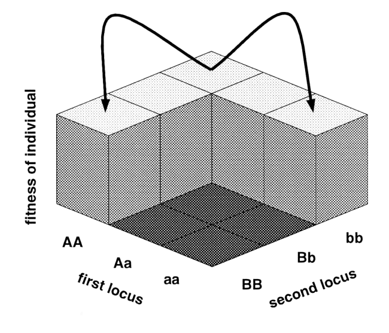

# speciation-sim

Command-line simulations of speciation via Bateson-Dobzhansky-Müller incompatibilties. `speciation-sim` begins with a population of $2N$ genomes, each homozygous at two unlinked loci ($AA$ and $BB$) that are subject to unidirectional mutation to alleles $a$ and $b$ at rate $\mu$. Following Gavrilets 2003 (see Figure 1 below), alleles $a$ and $B$ are incompatible (i.e. individuals that carry them have zero fitness). Reproductive isolation occurs when alleles $a$ and $b$ are fixed in the focal population, as any cross between this population and individuals carrying ancestral genotypes would be inviable. 

Under the allopatric model, alleles are randomly sampled from parent genomes each generation, resulting in $N$ new genpotypes at both loci. A selection coefficient $s$ influences the relative fitness (sampling probability) of mutant alleles (e.g., $w(a) = 1 + s$); speciation can thus proceed either purely by mutation and drift or via positive selection on BDMI loci. Under the parapatric model, a proportion $m$ of offspring alleles each generation originate in a migrant population fixed for the ancestral genotype. Under the periodic gene flow model, allopatric and parapatric regimes alternate every `<interval>`  generations. 

<figure align="center">
  
  <figcaption>
    <em>Figure 1.</em> Gavrilets (2003).
  </figcaption>
</figure>

## Installation

Clone the repository and install in editable mode:

```bash
git clone https://github.com/elinck/speciation-sim.git
cd speciation-sim
pip install -e .
```

To create a reproducible environment:

```bash
mamba env create -f environment.yml
mamba activate speciation-sim
pip install -e .
```

## Usage 

```bash
speciation-sim \
	--help \
	--model {allopatry,parapatry,periodic} \
	--N <int> \
	--mu <float> \
	--s <float> \
	--gen-max <int> \
	--m <float> \ 
	--interval <int> \

```

- `--help`: Display help menu. 
- `--model`: Select speciation model. Options include `allopatry` (no migration), `parapatry` (each generation, a proportion `m` of all alleles come from a migrant population monomophic for genotype `AA/BB`), or `periodic` (alternate between allopatric and parapatric regimes each `interval` generations).
- `--N`: Diploid population size (yields `2N` alleles each generation).
- `--mu`: Mutation rate (i.e., the probability a given allele from a parent in the focal population mutates to `a`).
- `--s`: Selection coefficient for mutant alleles (e.g., $w(a) = 1 + s$ and $w(b) = 1 + s$).
- `--gen-max`: The maximium number of generations to run the simulation. 
- `--m`: Migration rate (see `--model` above).
- `--interval`: Number of generations spent in a given gene flow regime before alternating.  

## References

Gavrilets, S. (2003). Perspective: models of speciation: what have we learned in 40 years?. Evolution, 57(10), 2197-2215.
